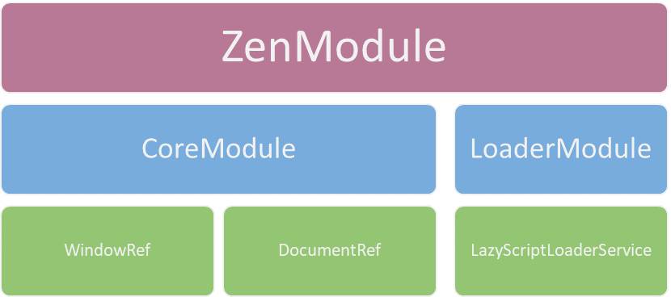
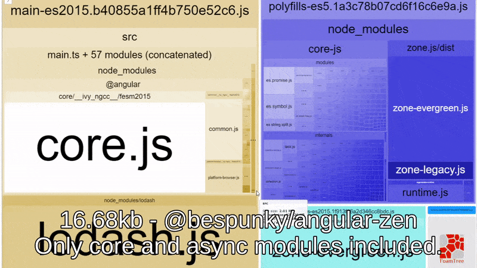

# Modules
`@bespunky/angular-zen` exports the following modules:

| Name | Description |
| ---  | ---         |
| [`CoreModule`](Modules/CoreModule) | Contains general tools that normally serve for infrastructure code. |
| [`AsyncModule`](Modules/AsyncModule) | Contains tools for handling dynamic and async situations on the page.    |
| [`UniversalModule`](Modules/UniversalModule) | Contains tools for working easily with Angular Universal and SSR. |
| [`LanguageIntegrationModule`](Modules/LanguageIntegrationModule) | Contains tools for integrating your library with your user's language services. |

# Exports Hierarchy
The following diagram shows the which tools are exported by which module:



# 🌳 Tree Shaking
The library is intended to be tree-shakable, meaning the compiler will only include modules used in your app in your final build.

For that reason, each module defines a secondary entry point. The end result is modules being packed separately, allowing the compiler to identify used modules and include them in the build.

For you it simply means that you have to import from the corresponding module (e.g. @bespunky/angular-zen/async), and not directly from @bespunky/angular-zen.

This is how a simple app build looks like when importing only the `core` and `async` modules. Other modules (e.g. `universal`) are not included.
[](.attachments/treeshaking.gif)
###### Created using [webpack-bundle-analyzer](https://www.npmjs.com/package/webpack-bundle-analyzer)
# Shared Module
If you find yourself frequently importing the same modules, consider creating a shared module for them and import that module instead:

1. Create the shared module:
    >  `ng generate module path/to/module/SharedZen`

2. Import zen modules into the shared module:
   ```typescript
    import { NgModule } from '@angular/core';

    // 1. Import modules (notice the from clause)
    import { CoreModule } from '@bespunky/angular-zen/core';
    import { AsyncModule } from '@bespunky/angular-zen/async';
    import { UniversalModule } from '@bespunky/angular-zen/universal';

    @NgModule({
        imports: [
            // 2. Include in shared module
            CoreModule,
            AsyncModule,
            UniversalModule
        ]
    })
    export class SharedZenModule { } 
   ```

3. Use the shared module in your app:
   ```typescript
    import { BrowserModule } from '@angular/platform-browser';
    import { NgModule } from '@angular/core';

    // 1. Import shared module
    import { SharedZenModule } from 'path/to/module/shared-zen.module';

    import { AppComponent } from './app.component';

    @NgModule({
        declarations: [
            AppComponent
        ],
        imports: [
            BrowserModule,
            SharedZenModule // 2. Include module in your app
        ],
        providers: [], 
        bootstrap: [AppComponent]
    })
    export class AppModule { }
   ```